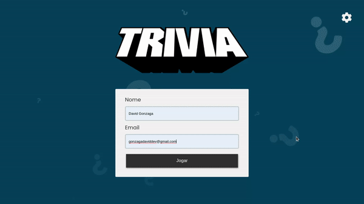

<h1>Trivia Game</h1>

## Equipe:
<a href="https://github.com/Gonzagadavid">David Gonzaga</a> / <a href="https://github.com/ericksilvadev">Erick Silva</a> / <a href="https://github.com/Thales-Daniel">Thales Daniel</a> / <a href="https://github.com/tatosampli">Tharcio Sampaio</a> / <a href="https://github.com/Raph2ll">Raphael Soares</a>

## Projeto de avaliação feito em equipe durante o curso da Trybe, buscando colocar em prática:

  - Criar um store Redux em aplicações React

  - Criar reducers no Redux em aplicações React

  - Criar actions no Redux em aplicações React

  - Criar dispatchers no Redux em aplicações React

  - Conectar Redux aos componentes React

  - Criar actions assíncronas na sua aplicação React que faz uso de Redux.

## Esse projeto foi submetido a testes de 21 requisitos, atingindo 100% dos que foi proposto:

### Tela de início/login

#### 1. Crie a tela de login, onde a pessoa que joga deve preencher as informações para iniciar um jogo

  **PRIORIDADE 0** - Criar a tela de login contendo as informações de nome e email, onde a pessoa que joga deve conseguir escrever seu nome e email nos inputs e o botão de jogar deve estar desabilitado caso não tenha alguma dessas informações.
  
Recomendamos que o Redux e o Router sejam configurados nesse requisito, para que os demais possam ser feitos paralelamente!

:warning: **Lembre-se das observações técnicas descritas acima para configurar a `store` do `Redux`.**

  **Observações técnicas**

  * A pessoa que joga deve conseguir escrever seu nome no input de texto
  * A pessoa que joga deve conseguir escrever seu email no input de email
  * O botão "Jogar" deve ser desabilitado caso email e/ou nome não estejam preenchidos
  * O campo de texto para o nome deve possuir o atributo `data-testid` com o valor `input-player-name`
  * O campo de texto para o email deve possuir o atributo `data-testid` com o valor `input-gravatar-email`
  * O botão "Jogar" que leva a pessoa ao jogo deve possuir o atributo `data-testid` com o valor `btn-play`

  **O que será avaliado**

  * Escreve o nome da pessoa jogadora
  * Escreve o email da pessoa jogadora
  * Botão Jogar desabilitado quando pessoa jogadora não preencher nenhum campo
  * Botão Jogar desabilitado quando pessoa jogadora escrever apenas o nome
  * Botão Jogar desabilitado quando pessoa jogadora escrever apenas o email
  * Botão Jogar habilitado quando pessoa jogadora preencher os campos de nome e email

#### 2. Crie o botão de iniciar o jogo

  **PRIORIDADE 1** - O botão "Jogar" deve fazer requisição para a API para obter o token e redirecionar a pessoa para tela de jogo

  **Observações técnicas**

  * Após clicar no botão "Jogar", a pessoa deve ser redirecionada para a tela do jogo
  * Ao clicar no botão "Jogar", um requisição para a API do Trivia deve ser feita para obter o _token_ de jogador
  * O _token_ deve ser armazenado na aplicação e enviado em todas as requisições seguintes.
  * Salve no `LocalStorage` o _token_ recebido utilizando a chave `token`

  **O que será avaliado**

  * Inicia jogo salvando um token de jogador

#### 3. Crie um botão que leva a pessoa para tela de configuração

  **PRIORIDADE 1** - A tela inicial deve conter um botão que leve para a configuração do jogo

  **Observações técnicas**

  * O botão que leva a pessoa a tela de configurações deve possuir o atributo `data-testid` com o valor `btn-settings`
  * A tela de configurações deve possuir um título com o atributo `data-testid` contendo o valor `settings-title`

  **O que será avaliado**

  * O botão deve existir na página
  * A tela de configurações deve possuir um título

### Tela de jogo

#### 4. Crie um _header_ que deve conter as informações da pessoa jogadora

  **PRIORIDADE 1** - O header deve conter as informações sobre a pessoa jogadora, como a imagem do Gravatar, o nome e o placar

  **Observações técnicas**

  * A imagem do perfil vinda do Gravatar em um elemento que deve possuir o atributo `data-testid` com o valor `header-profile-picture`
  * O nome da pessoa em um elemento que deve possuir o atributo `data-testid` com o valor `header-player-name`
  * O placar zerado em um elemento que deve possuir o atributo `data-testid` com o valor `header-score`

  **O que será avaliado**

  * A imagem do Gravatar está presente no header
  * O nome da pessoa está presente no header
  * O placar zerado está presente no header

#### 5. Crie a página de jogo que deve conter as informações relacionadas à pergunta

  **PRIORIDADE 1** - Deve ser feita a requisição para a API para popular o jogo com as perguntas, categoria e alternativas

  **Observações técnicas**

  * A pergunta e suas alternativas de resposta devem ser recebidas da API do Trivia
  * A categoria da pergunta (campo _category_) deve ser exibida em um elemento com o atributo `data-testid` com o valor `question-category` para a pessoa que está jogando
  * O texto da pergunta (campo _question_) deve ser exibido em um elemento com o atributo `data-testid` com o valor `question-text` para a pessoa que está jogando
  * O texto com as alternativas devem ser exibidos seguindo as regras abaixo:
    * O elemento com a alternativa correta deve possuir o atributo `data-testid` com o valor `correct-answer`
    * Os elementos com as alternativas incorretas devem possuir o atributo `data-testid` com o valor `wrong-answer-${index}`, com `${index}` iniciando com o valor `0`
    * As alternativas devem ser exibidas em ordem aleatória
    * Dica: utilize botões (`<button/>`) para as alternativas
  
  **O que será avaliado**

  * A categoria da pergunta está presente
  * O texto da pergunta está presente
  * As alternativas devem estar presentes

#### 6. Desenvolva o jogo onde só deve ser possível escolher uma resposta correta por pergunta

  **PRIORIDADE 2** - A pergunta deve ter apenas uma alternativa correta

  **Observações técnicas**

  * Apenas uma alternativa deve ser a correta

  **O que será avaliado**

  * A quantidade de respostas corretas deve ser 1

#### 7. Desenvolva o estilo que, ao clicar em uma resposta, a correta deve ficar verde e as incorretas, vermelhas

  **PRIORIDADE 2** - Ao responder a pergunta, se a alternativa for correta, deve ficar verde, caso contrário, vermelha

  **Observações técnicas**

  * Utilize a propriedade css `border` com o valor `3px solid rgb(6, 240, 15)` para a alternativa correta.
  * Utilize a propriedade css `border` com o valor `3px solid rgb(255, 0, 0)` para as alternativas incorretas.

  **O que será avaliado**

  * Verifica cor da alternativa correta quando acerta a questão
  * Verifica a cor das alternativas incorretas quando acerta a questão
  * Verifica cor da alternativa correta quando erra a questão
  * Verifica a cor das alternativas incorretas quando erra a questão

#### 8. Desenvolva um timer onde a pessoa que joga tem 30 segundos para responder

  **PRIORIDADE 3** - A página deve conter um timer que com o tempo máximo de 30 segundos para responder, caso ultrapasse o tempo, a pergunta é considerada errada

  **Observações técnicas**

  * Caso a pergunta não seja respondida a tempo, a resposta é considerada como errada
  * Respostas incorretas não somam pontos ao placar
  * Um temporizador deve aparecer na tela da pessoa, começando de 30 segundos e indo de forma decrescente até zero
  * Após o tempo se esgotar, todos os botões das alternativas devem ser desabilitados

  Dica: Lembre-se do setTimeout e do setInterval

  **O que será avaliado**

  * Aguarda 5 segundos e responde a alternativa correta
  * Aguarda mais de 30 segundos para responder

#### 9. Crie o placar com as seguintes características:

  **PRIORIDADE 3** - Ao clicar na resposta correta, pontos devem ser somados no placar da pessoa que está jogando

  **Observações técnicas**

  * Você deve salvar a pontuação **atual** no `localStorage`
  * Leia a seção [Observações técnicas](#observações-técnicas) para mais detalhes
  * Respostas erradas não devem somar ao placar
  * A fórmula para cálculo dos pontos por pergunta é: `10 + (timer * dificuldade)`, onde timer é o tempo restante no contador de tempo e dificuldade é `hard: 3, medium: 2, easy: 1`, dependendo da pergunta. Exemplo: Se no momento da resposta correta o timer estiver contando 17 segundos, e a dificuldade da pergunta é 2 (média), a pontuação deve ser: `10 + (17 * 2) = 44`

   **O que será avaliado**

   * Soma pontos ao acertar uma questão
   * Não soma pontos ao errar uma questão

#### 10. Crie um botão de "próxima" que apareça após a resposta ser dada

  **PRIORIDADE 3** - Deve aparecer um botão de "Próxima" (pergunta) após a resposta ser dada

  **Observações técnicas**

  * O botão "Próxima" deve possuir o atributo `data-testid` com o valor `btn-next`
  * Ao clicar nesse botão, a próxima pergunta deve aparecer na tela

  **O que será avaliado**

  * O botão de próxima pergunta não deve ser visível o início do jogo
  * Botão de próxima pergunta é visível quando a pergunta é respondida corretamente
  * Botão de próxima pergunta é visível quando a pergunta é respondida incorretamente

#### 11. Desenvolva o jogo de forma que a pessoa que joga deve responder 5 perguntas no total

  **PRIORIDADE 2** - O jogo deve ser composto por 5 perguntas, onde, a cada nova pergunta, o timer é reiniciado e após respondê-las, a pessoa que joga deve ser redirecionada para a tela de feedback

  **Observações técnicas**

  * A cada nova pergunta o temporizador deve ser reiniciado para 30 segundos
  * Após a quinta pergunta, o botão "Próxima" deve redirecionar a pessoa para a tela de _Feedback_
  * Para perguntas com type:"boolean", mostrar somente 2 campos (um para cada resposta possível)
  * Para perguntas com type:"multiple", mostrar a quantidade necessária de campos (um para cada resposta possível)
  * O elemento da mensagem de _feedback_ deve possuir o atributo `data-testid` com o valor `feedback-text`

  **O que será avaliado**

  * Acerta todas as perguntas
  * Erra todas as perguntas
  * Redireciona para a tela de _feedback_ após a quinta pergunta

### Tela de feedback

#### 12. Desenvolva o header de _feedback_ que deve conter as informações da pessoa jogadora

  **PRIORIDADE 0** - A tela de feedback deve conter as informações da pessoa que joga, incluindo o placar com o valor referente ao desempenho no jogo

  **Observações técnicas**

  * A imagem do perfil vinda do Gravatar em um elemento que deve possuir o atributo `data-testid` com o valor `header-profile-picture`
  * O nome da pessoa em um elemento que deve possuir o atributo `data-testid` com o valor `header-player-name`
  * O placar com o valor **atual** em um elemento que deve possuir o atributo `data-testid` com o valor `header-score`

  **O que será avaliado**

  * A imagem do Gravatar está presente no header
  * O nome da pessoa está presente no header
  * O placar com o valor atual está presente no header

#### 13. Crie a mensagem de _feedback_ para ser exibida a pessoa usuária

  **PRIORIDADE 1** - A tela de feedback deve exibir uma mensagem relacionada ao desempenho da pessoa que jogou

  **Observações técnicas**

  * A mensagem deve ser "Podia ser melhor..." caso a pessoa acerte menos de 3 perguntas
  * A mensagem deve ser "Mandou bem!" caso a pessoa acerte 3 perguntas ou mais
  * O elemento da mensagem de _feedback_ deve possuir o atributo `data-testid` com o valor `feedback-text`

  **O que será avaliado**

  * Acertou menos de 3 perguntas
  * Acertou 3 perguntas
  * Acertou mais de 3 perguntas

#### 14. Exiba as informações relacionadas aos resultados obtidos para a pessoa usuária

  **PRIORIDADE 1** - A tela de feedback deve exibir informações sobre o desempenho da pessoa, como o placar final e o número de perguntas que acertou

  * O placar final deve ser mostrado em um elemento com o atributo `data-testid` com o valor `feedback-total-score`
  * O número de perguntas que a pessoa acertou deve ser exibido em um elemento com o atributo `data-testid` com o valor `feedback-total-question`

  **O que será avaliado**
  * Não acertou nenhuma pergunta
  * Acertou 2 perguntas
  * Acertou 4 perguntas

#### 15. Crie a opção para a pessoa jogadora poder jogar novamente

  **PRIORIDADE 3** - A pessoa terá a opção "Jogar novamente", que ao ser clicada, levará para a tela de inicial

  * Ao clicar no botão "Jogar novamente", a pessoa deve ser redirecionada para a tela de início (login)
  * O botão para jogar novamente deve possuir o atributo `data-testid` com o valor `btn-play-again`

  **O que será avaliado**

  * A pessoa deve ser redirecionada para tela inicial

#### 16. Crie a opção para a pessoa jogadora poder visualizar a tela de _ranking_

  **PRIORIDADE 3** - Deve existir um botão que redirecione a pessoa para a tela de ranking

  **Observações técnicas**

  * Ao clicar no botão "Ver Ranking", a pessoa deve ser redirecionada para a tela de _ranking_
  * O botão para ir para a tela de _ranking_ deve possuir o atributo `data-testid` com o valor `btn-ranking`
  * A tela de _ranking_ deve possuir um título com o atributo `data-testid` contendo o valor `ranking-title`

  **O que será avaliado**

  * A pessoa deve ser redirecionada para tela de ranking

### Tela de ranking

#### 17. Crie a tela de _ranking_

  **PRIORIDADE 2** - A tela de ranking deve possuir uma lista com a imagem, nome e pontuação das pessoas que jogaram e deve ficar armazenado no localStorage

  **Observações técnicas**

  * Deve-se mostrar uma lista com a imagem de perfil vinda do Gravatar, nome e pontuação das pessoas que jogaram em ordem decrescente (da maior pontuação para a menor)
  * Os elementos com os nomes das pessoas que jogaram devem possuir o atributo `data-testid` com o valor `player-name-${index}`, onde `${index}` é iniciado em zero
  * Os elementos com as pontuações das pessoas que jogaram devem possuir o atributo `data-testid` com o valor `player-score-${index}`, onde `${index}` é iniciado em zero
  * O ranking deve ser armazenado no navegador através do `localStorage`.
  * Leia a seção [Observações técnicas](#observações-técnicas) para mais detalhes

  **O que será avaliado**

  * Deve existir uma pessoa no _ranking_
  * Devem existir duas pessoas no _ranking_
  * O _ranking_ deve ser ordenado pela pontuação

#### 18. Crie um botão para ir ao início

  **PRIORIDADE 3** - O botão deve redirecionar a pessoa para a tela de inicial (login)

  **Observações técnicas**

  * Esse botão deve possuir o atributo `data-testid` com o valor `btn-go-home`
  * Esse botão deve enviar a pessoa para o início (tela de preenchimento dos dados)

  **O que será avaliado**

  * Volta para a tela inicial

### Extra não avaliativo: Tela de configurações

##### 19. Ao mudar o valor do dropdown categoria, apenas perguntas da categoria selecionada devem aparecer para a pessoa que está jogando. Essa configuração será identificada pela chave category no retorno da API;

##### 20. Ao mudar o valor do dropdown dificuldade, apenas perguntas da dificuldade selecionada devem aparecer para a pessoa que está jogando. Essa configuração será identificada pela chave difficulty no retorno da API;

##### 21. Ao mudar o valor do dropdown tipo, apenas perguntas do tipo selecionado devem aparecer para a pessoa que está jogando. Essa configuração será identificada pela chave type no retorno da API.

