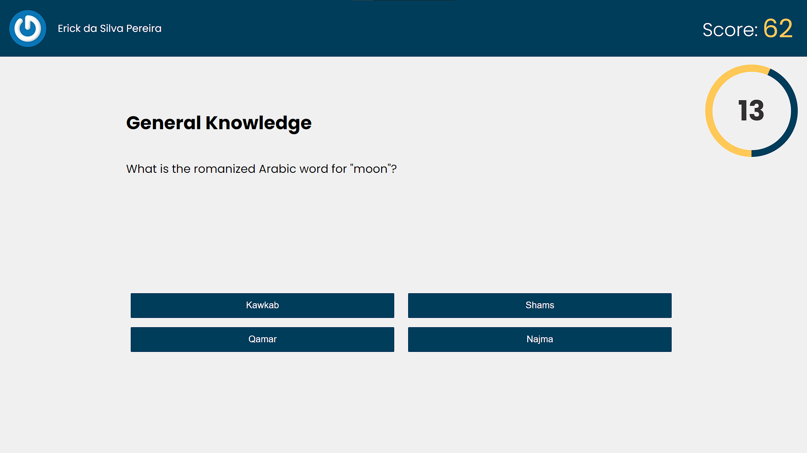

# Boas vindas ao repositório do projeto Trivia Game!

Este é um jogo de perguntas e respostas que utiliza a api [Open Trivia DB](https://opentdb.com/api_config.php) para gerar perguntas aleatórias. Este projeto foi desenvolvido em grupo com [David Gonzaga](https://github.com/Gonzagadavid), [Thales Daniel](https://github.com/Thales-Daniel), [Raphael](https://github.com/Raph2ll) e [Tharcio Sampaio](https://github.com/tatosampli).

*Este projeto foi desenvolvido seguindo os requisitos e testes passados pela [Trybe](https://www.betrybe.com/), somente os estilos foram feitos de maneira totalmente independente.*

## Principais tecnologias usadas

* [React](https://pt-br.reactjs.org/)
* [Redux](https://redux.js.org/)
* [Sass](https://sass-lang.com/)
* [Trello](https://trello.com/pt-BR)

## Como rodar o projeto localmente

* Faça o clone do repositório
* Rode o comando `npm install`
* Inicialize o projeto em um servidor local com `npm start`
